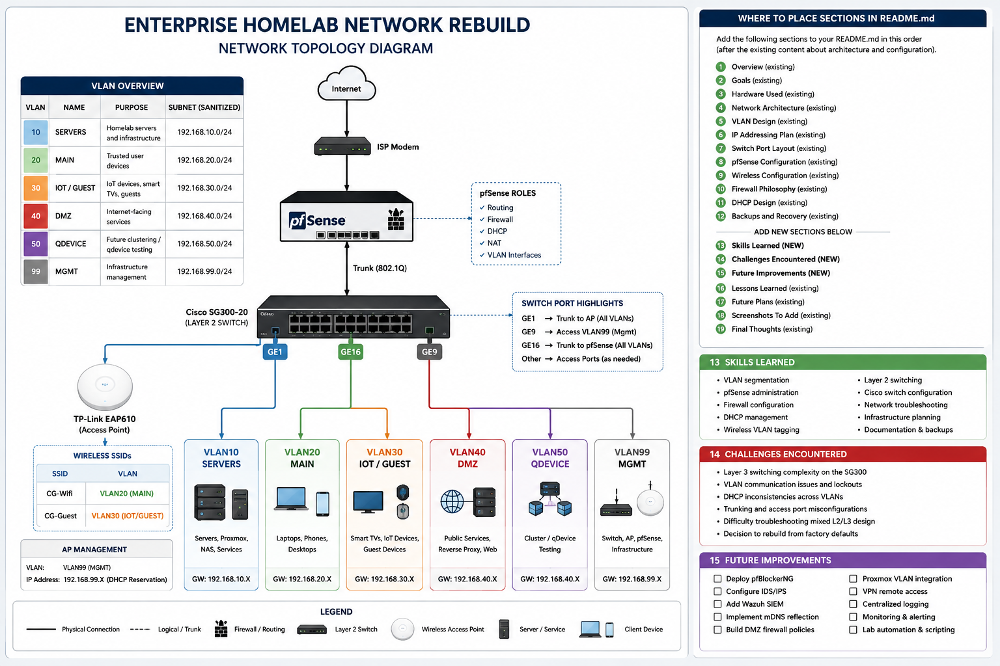

# Enterprise Homelab Network Rebuild

## Overview

This project documents the complete rebuild of my homelab network using:

- pfSense CE 2.8.1
- Cisco SG300-20 Managed Switch
- TP-Link EAP610 Access Point
- VLAN segmentation
- Layer 2 switching architecture
- Centralized routing and firewalling through pfSense

The purpose of this project was to redesign and stabilize my network after multiple Layer 3 switching and VLAN management issues. The rebuilt architecture follows a cleaner enterprise-style design where:

- The Cisco switch operates strictly in Layer 2 mode
- pfSense handles all routing and firewall policies
- VLANs are segmented by purpose
- Infrastructure management is isolated
- Wireless SSIDs are VLAN-tagged

---

# Goals

## Primary Goals

- Rebuild the network from scratch
- Eliminate Layer 3 switching complexity
- Centralize routing through pfSense
- Create secure VLAN segmentation
- Build a stable management network
- Implement enterprise-style networking practices
- Reduce downtime during future changes
- Prepare the environment for cybersecurity labs and services

---

# Hardware Used

## Router

- Supermicro X11SSH-LN4F
- pfSense CE 2.8.1

## Switch

- Cisco SG300-20 Gigabit Managed Switch

## Wireless Access Point

- TP-Link EAP610

## Additional Infrastructure

- Proxmox servers
- Home lab services
- Future NAS and monitoring systems

---

# Final Network Architecture

```text
Internet
   ↓
ISP Modem
   ↓
pfSense Router
   ↓
Cisco SG300-20 (Layer 2)
   ├── GE1  → TP-Link EAP610 (Trunk)
   ├── GE9  → Management Port (VLAN99)
   ├── GE16 → pfSense LAN Trunk
   └── Server/Client Ports
```

---

## Network Topology Diagram



---

# VLAN Design

| VLAN | Name | Purpose | Subnet |
|------|------|----------|---------|
| 10 | SERVERS | Homelab servers and infrastructure | 192.168.10.0/24 (sanitized example) |
| 20 | MAIN | Trusted user devices | 192.168.20.0/24 (sanitized example) |
| 30 | IOT/GUEST | Smart TVs, IoT, guest devices | 192.168.30.0/24 (sanitized example) |
| 40 | DMZ | Internet-facing services | 192.168.40.0/24 (sanitized example) |
| 50 | QDEVICE | Future clustering/qdevice testing | 192.168.50.0/24 (sanitized example) |
| 99 | MGMT | Infrastructure management | 192.168.99.0/24 (sanitized example) |

---

# IP Addressing Plan

| Device | IP Address |
|------|-------------|
| pfSense | 192.168.99.X |
| Cisco SG300-20 | 192.168.99.X |
| TP-Link EAP610 | 192.168.99.X |

---

# Switch Port Layout

| Port | Purpose | VLAN Configuration |
|------|----------|-------------------|
| GE1 | TP-Link EAP610 | Trunk |
| GE9 | Management Port | Access VLAN99 |
| GE16 | pfSense Trunk | Trunk |

---

# Major Design Decision

## Layer 2 Switching vs Layer 3 Switching

Originally, the Cisco SG300-20 was configured in Layer 3 mode and handled VLAN routing.

This caused:

- VLAN communication problems
- Management lockouts
- DHCP inconsistencies
- Trunking confusion
- Routing complexity
- Difficult troubleshooting

The final solution was:

- Reset the switch to factory defaults
- Rebuild the network using Layer 2 switching only
- Move all routing and firewalling to pfSense

This dramatically simplified the environment and stabilized the network.

---

# pfSense Configuration

## VLAN Interfaces Created

| VLAN | Interface |
|------|------------|
| VLAN10 | igb1.10 |
| VLAN20 | igb1.20 |
| VLAN30 | igb1.30 |
| VLAN40 | igb1.40 |
| VLAN50 | igb1.50 |
| VLAN99 | igb1.99 |

## Gateway Assignments

| VLAN | Gateway |
|------|----------|
| VLAN10 | 192.168.10.X |
| VLAN20 | 192.168.20.X |
| VLAN30 | 192.168.30.X |
| VLAN40 | 192.168.40.X |
| VLAN50 | 192.168.50.X |
| VLAN99 | 192.168.99.X |

---

# Wireless Configuration

## SSIDs

| SSID | VLAN |
|------|------|
| CG-Wifi | VLAN20 |
| CG-Guest | VLAN30 |

## AP Management

The TP-Link EAP610 management interface was assigned to VLAN99.

A DHCP reservation was configured in pfSense to ensure the AP always receives:

```text
192.168.99.X
```

---

# Firewall Philosophy

The network was designed with segmentation and security in mind.

## VLAN20 (Main)

- Trusted user devices
- Internet access allowed
- Controlled access to servers and management systems

## VLAN30 (IoT/Guest)

- Smart TVs
- Streaming devices
- IoT equipment
- Internet access only
- Restricted from management and server VLANs

## VLAN40 (DMZ)

- Internet-facing services
- Isolated from internal infrastructure

## VLAN99 (Management)

- Switch management
- AP management
- pfSense administration
- Infrastructure access only

---

# DHCP Design

## VLAN99 DHCP Range

```text
192.168.99.150 - 192.168.99.199 (sanitized example range)
```

Infrastructure devices use reserved/static addresses outside the DHCP pool.

---

# Backups and Recovery

Configuration backups were created for:

- pfSense
- Cisco SG300-20
- TP-Link EAP610

Backups were stored locally and redundantly copied for disaster recovery.

---

# Lessons Learned

## 1. Keep the Switch Simple

Layer 2 switching with centralized routing in pfSense is significantly easier to manage and troubleshoot.

## 2. Dedicated Management VLANs Matter

Separating infrastructure management from user traffic improves both security and organization.

## 3. Documentation Is Critical

Keeping backup configurations and documenting VLAN assignments prevents future recovery problems.

## 4. Rebuilding Can Be Faster Than Troubleshooting

After extensive troubleshooting, performing a clean rebuild was ultimately the best solution.

---

# Future Plans

Planned future additions include:

- pfBlockerNG
- Wazuh
- SIEM monitoring
- Proxmox VLAN integration
- Home Assistant
- Plex segmentation
- Reverse proxy services
- VPN hardening
- IDS/IPS testing
- Centralized logging

---

# Skills Demonstrated

- VLAN segmentation
- Layer 2 switching
- pfSense administration
- Firewall configuration
- DHCP management
- Wireless VLAN tagging
- Infrastructure planning
- Network troubleshooting
- Enterprise network design concepts
- Backup and recovery procedures

---

# Screenshots To Add

## Suggested Screenshots

- pfSense VLAN interfaces
- Firewall rules
- Cisco switch VLAN configuration
- Port VLAN membership
- AP SSID VLAN tagging
- DHCP reservations
- Successful connectivity tests
- Final topology diagram

---

# Security and Privacy Note

All IP addresses, DHCP ranges, and infrastructure identifiers in this document have been sanitized for safe public GitHub publication. The architecture, VLAN design, and implementation process remain technically accurate while protecting operational security.

---

# Final Thoughts

This project became a complete redesign of my homelab network architecture. The final environment is now stable, segmented, easier to manage, and designed to support future cybersecurity, systems administration, and infrastructure labs.

The rebuild reinforced an important lesson:

> Simplicity and proper architecture beat unnecessary complexity.
